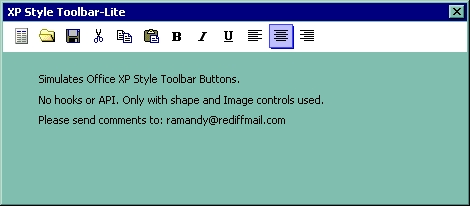



## Office XP Style Toolbar\-Lite

### Description

Creates Office XP Style Toolbar using image controls and shape. very lite. just try it. comments to ramandy@rediffmai.com
 
### More Info
 
no side effects

             |
---                |---
**Submitted On**   |2003-08-06 03:50:02
**By**             |[Prasanth Raveendran](https://github.com/Planet-Source-Code/PSCIndex/blob/master/ByAuthor/prasanth-raveendran.md)
**Level**          |Intermediate
**User Rating**    |4.9 (59 globes from 12 users)
**Compatibility**  |VB 3\.0, VB 4\.0 \(16\-bit\), VB 4\.0 \(32\-bit\), VB 5\.0, VB 6\.0
**Category**       |[Custom Controls/ Forms/  Menus](https://github.com/Planet-Source-Code/PSCIndex/blob/master/ByCategory/custom-controls-forms-menus__1-4.md)
**World**          |[Visual Basic](https://github.com/Planet-Source-Code/PSCIndex/blob/master/ByWorld/visual-basic.md)
**Archive File**   |[Office\_XP\_162473862003\.zip](https://github.com/Planet-Source-Code/prasanth-raveendran-office-xp-style-toolbar-lite__1-47444/archive/master.zip)

